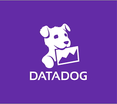

# Abhishek

## Data is Coming :partying_face:

And the Data arrives. Well I have no idea, what is that data all about but just heard it is around ~ 10 GB.
Well its gonna be structured, so it gonna be really easy to estimate, isn't it :relieved:

We all connected, and all of us were pretty much convinced on easy sql engine, maybe postgres and then we can simply run 
some basic query for data analysis.

Then we finally decided to look into the data, it was CSV, yeah 10 GB of CSV ( gzipped) :hot_face: !

### Time for debate
Nothing is easy !
A huge file of csv, unzipped and we have now many things to consider
	
	* Is it really gonna be the only file ?
	* Is the data actually clean ??
	* Is postgres really a smart choice ?
	* If we already have bigdata platform setup, why not using it ?
	* Are we really gonna use all the fields in the data
	* ...

So the best choice was to really focus on data exploration!

## Data Exploration

Data Exploration is really not about loading the data, but here first we need to know the data!
To know more about data, we have the default choice - Apache Spark

	
	1. Store the data on any distributed file system, lets consider here S3.
	2. Load data in Apache Spark
	3. Run analysis, peace of cake :pancakes:

No, how can it be so easy ? Well its a single file of < 10 GB of size and Spark Driver gonna hurt very badly. So it is really not 
a logical way to just load this data on spark and do anything.

### Data Partition Plan

We need a way to make this process __scalable__!
We decided to split the data into multiple partitions of some reasonable size. As its spark, we are deciding on __~150 - 250 MB__.

Do we really wanna continue using CSV ? 
No, we need a more optimized columnar data format, so Parquet was an obvious choice for us.

	1. Load the data in Spark
	2. Write the data back to S3 within partition range as Parquet Data Format.

### Data Exploration Visualization

We heard data is ready, can we explore the data! Suddenly Data Analysts & Data Scientists jumped into the discussion.
No, You cannot :rotating_light:

As a data engineer, I can imagine visualization over command line, but I am not sure my colleagues are really gonna hate me 
for that. So, we need to provide an interface.
So our data exploration platform should have the following -

	1. Open Sourced
	2. Support Large Scale data exploration
	3. Fancy Graphs
	4. Dashboarding
	5. Sharing
	6. Governance

So technically, it asked for almost everything as a __large scale project__.
Well after many hours of discussions -

 

	 1. PRESTO, an open source distributed SQL query engine 
	 2. METABASE, open source way for everyone in your company to ask questions and learn from data.

_disclaimer: There are still discussions on why not apache superset or some other distributed sql engine & I am sure its never gonna end._

  

But for now we have an amazing interface which can be used by our Analysts & Scientists to explore the data and learn insights.
Hurray, we can now make Data Driven Decisions. Can we :cold_sweat:

## Big Data

Well we were expecting to calm down & then suddenly we got hit by data, a lot of data.
__The problem now shifted from data to BigData__

So what, we have _Spark cluster and partition_, so we will transform everything to parquet and life is great	:sunglasses:.
Easy guys, well there are some problems we never addressed when we started -

	1. Queries are too slow
	2. Infrastructure is burning too much money
	3. Even its structered data, its has too many Nulls, weird characters and what not
	4. Way too much data to explore

We realized we never optimized the job for faster query, but just to add partitions. There was not even a discussion on data cleaning as we were 
not aware what to expect. Big Data came too soon & we didn't had any pipeline managing that.

### Data Platform

This is where actual engineering begins. We sat with Data Analysts & Data Scientists to plan 

	1. We are receiving data every data, so we need to run a batch job every day
	2. There are more than 300 + columns in the data, but there are some specific point of interests for now
	3. Create Data Partitions based on identifiers ( Date, Id, POIs) etc.
	4. Data has too many gaps and have many duplicates, add spark transformations for clean data
	5. Data Scientists are interested on more deeper level on the data, so schedule another job 
	on top of first level of processing.
	6. Data Analysts may want to run some crazy query, so what about manually trigger batch jobs.
	7. There are some queries which are too common, why not keeping that inside data pipeline! :imp:
	8. What about feature engineering :worried:

### Scala / Python / Java or what ?

 

Well entire team understands python, but Spark is still not great with Python. What if in future we need to connect to Kafka, well Python... Naaah!
__So why not data pipeline on Scala & Data Science related logic on Python.__
Yeah, its 2 languages, but we can work with it.

### Workflow 

We have now many jobs, running on different point in time and we are now talking about scheduler.
Yeah not a cron job for sure, so we need a platform to programmatically author, schedule and monitor workflows.

  

__Again The Debate__

This should never end, as now open source community is brining too many options and every options has its own factor, but considering other group and previous 
experince, we concluded on __Apache Airflow__. ( #fornow )

## All done, Really!

So now we have airflow to schedule all the jobs. There is a manual trigger via interface. Metabase to explore data and run faster query. And Spark pipeline to clean
and build features. We are done .. yeah :cowboy_hat_face:

No, That is No!
Where is minitoring. Really

    

	1. Job failed after office hours
	2. Everybody hates pagerduty 
	3. What failed and how to debug
	4. There is sudden spike in resource utilization, why ?
	5. Why suddenly this job is slow ?
	6. Nobody has any idea what am I running in cluster, nothing to worry :astonished: ?
